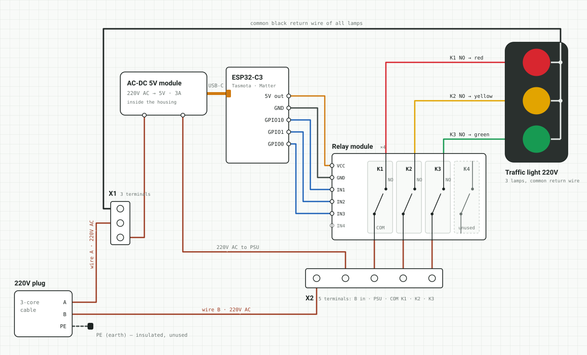
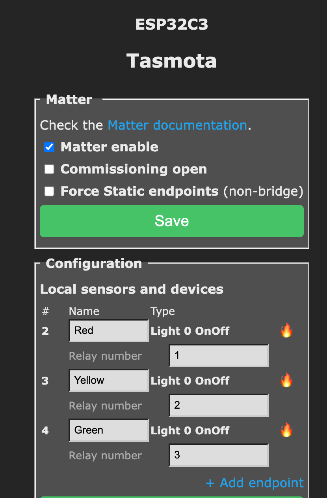

# Hardware: building the traffic light

Step-by-step guide to turning an old 220V traffic light into a smart one: an ESP32-C3 running Tasmota switches three lamps through a relay module.

> **Warning.** This build works with 220V mains. Do all wiring with the plug pulled out of the socket. If you are not confident working with mains voltage, ask someone qualified to check the 220V part before the first power-on.

## Wiring diagram



How it works: 220V from the plug is split by two terminal blocks. One side feeds a 5V AC-DC module that powers the ESP32-C3, the other side goes to the relay contacts. The ESP32 drives the relays, and the relays switch the lamps. All lamps share one common return wire.

### Wire colors

| Color | Meaning |
|---|---|
| Brown | 220V AC from the plug |
| Black | Common return wire of all lamps |
| Red / yellow / green | 220V AC from relay NO contacts to each lamp |
| Orange | 5V: USB-C power and relay module power |
| Dark gray | GND |
| Blue | GPIO control signals |

### Connections

| From | To | Purpose |
|---|---|---|
| **Low voltage** | | |
| AC-DC module USB-C | ESP32-C3 USB-C | 5V power for the board |
| ESP32-C3 `5V` | Relay `VCC` | Relay coil power |
| ESP32-C3 `GND` | Relay `GND` | Common ground |
| ESP32-C3 `GPIO10` | Relay `IN1` → K1 | Red lamp |
| ESP32-C3 `GPIO1` | Relay `IN2` → K2 | Yellow lamp |
| ESP32-C3 `GPIO0` | Relay `IN3` → K3 | Green lamp |
| **220V** | | |
| Plug wire A | X1 | AC-DC module and common lamp wire |
| Plug wire B | X2 | AC-DC module and COM of K1–K3 |
| K1 / K2 / K3 `NO` | Red / yellow / green lamp | Switched wire of each lamp |
| Plug `PE` | — | Insulated, not used |

The plug can be inserted either way, so mains wires are labeled A and B instead of phase and neutral. The circuit works with either polarity. The relay breaks only the lamp's own wire, so depending on how the plug is inserted, the common wire and the lamp sockets can stay live while a lamp is off. Always unplug before opening the housing.

PE is not used, which is only acceptable for a non-conductive housing. If the traffic light housing is metal, connect PE to the housing.

## Parts

- Traffic light with three 220V lamps and a common return wire.
- ESP32-C3 board with a 5V pin.
- 4-channel 5V relay module with optocouplers, contacts rated for at least 250V AC 10A. Only 3 channels are used.
- AC-DC 5V module with a USB-C output, 5V 3A.
- USB-C to USB-C cable (short) from the AC-DC module to the ESP32-C3.
- Terminal blocks: X1 with 3 terminals, X2 with 5 terminals.
- Power cable with a plug, 3 cores, at least 0.75 mm².
- Dupont wires for the low-voltage side, heat-shrink tubing, cable ties.
- Multimeter.

## Build steps

### 1. Prepare the traffic light

1. Open the housing and find the lamp wires.
2. Use a multimeter in continuity mode to find the common wire shared by all three lamps and the individual wire of each lamp.
3. Label the wires: common, red, yellow, green.
4. Decide where the AC-DC module, ESP32-C3, relay module and terminal blocks will sit inside the housing. Keep the low-voltage parts away from the 220V terminals.

### 2. Flash Tasmota onto the ESP32-C3

Do this before mounting anything, with the board powered only from your computer's USB.

1. Open the [Tasmota Web Installer](https://tasmota.github.io/install/) in a desktop Chrome or Edge. The installer uses Web Serial, which Firefox and Safari do not support.
2. Connect the ESP32-C3 to the computer with a USB-C data cable. Charge-only cables will not work.
3. In the installer, choose the regular **Tasmota** build. The installer picks the ESP32-C3 variant automatically.
4. Press **Connect** and select the serial port of the board. If no port shows up, unplug the board, hold the **BOOT** button, plug it back in and release the button.
5. Enable **Erase device** for the first install and press **Install**.
6. After flashing, the installer offers to set up Wi-Fi over the serial connection. Enter your 2.4 GHz Wi-Fi name and password.
   If you skip this step, the board starts its own access point named `tasmota-XXXXXX`. Connect to it, open `http://192.168.4.1` and enter the Wi-Fi credentials there.
7. Find the board's IP address in the installer or in your router, open it in a browser and check that the Tasmota web UI loads.
8. Reserve this IP address for the board in your router (DHCP reservation). This address goes into `TASMOTA_HOST` in `.env`.

### 3. Configure Tasmota

1. In the Tasmota web UI open **Configuration → Module**.
2. Set the pins:
   - `GPIO10` → `Relay_i` `1` (red)
   - `GPIO1` → `Relay_i` `2` (yellow)
   - `GPIO0` → `Relay_i` `3` (green)
3. Press **Save**. The board reboots and shows three toggle buttons.

`Relay_i` means inverted output: optocoupler relay modules switch on when the input is pulled low. If your relays turn on when Tasmota shows OFF, use `Relay` instead of `Relay_i`.

Then open **Tools → Console** and run:

```
PowerOnState 0
Interlock 0
```

- `PowerOnState 0` keeps all lamps off after a power outage.
- `Interlock 0` allows several lamps to be on at the same time. With interlock enabled Tasmota turns other relays off.

The code expects relay 1 to be red, relay 2 yellow and relay 3 green (`Power1`, `Power2`, `Power3`).

### 4. Wire the low-voltage side

With the board still powered from the computer USB:

1. `5V` → relay `VCC`.
2. `GND` → relay `GND`.
3. `GPIO10` → `IN1`, `GPIO1` → `IN2`, `GPIO0` → `IN3`. `IN4` stays unconnected.
4. In the Tasmota console run:

   ```
   Backlog0 Power1 ON; Power2 ON; Power3 ON
   Backlog0 Power1 OFF; Power2 OFF; Power3 OFF
   ```

   All three relays should click on and off together. `Backlog0` runs commands without a delay, so the relays switch at the same time.
5. Check each relay separately with `Power1 TOGGLE`, `Power2 TOGGLE` and `Power3 TOGGLE` and make sure the right relay clicks.

### 5. Wire the 220V side

Unplug the USB cable from the computer before this step. Nothing is connected to mains yet.

1. Plug wire A → X1.
2. X1 → one input terminal of the AC-DC module.
3. X1 → common wire of the lamps.
4. Plug wire B → X2.
5. X2 → the other input terminal of the AC-DC module.
6. X2 → `COM` of K1, K2 and K3.
7. K1 `NO` → red lamp wire, K2 `NO` → yellow lamp wire, K3 `NO` → green lamp wire.
8. Insulate the PE core of the cable, or connect it to the housing if the housing is metal.
9. Connect the AC-DC module USB-C output to the ESP32-C3.
10. Check every screw terminal by pulling the wire gently. Make sure no bare copper sticks out of the terminals.
11. With a multimeter in continuity mode, check that there is no short between plug pins A and B.
12. Fix the power cable inside the housing with a cable tie so that pulling the cable does not pull the terminals.

### 6. First power-on

1. Close the housing.
2. Plug the traffic light in. All lamps should stay off because of `PowerOnState 0`.
3. Open the Tasmota web UI and toggle each lamp.
4. Run the `cycle` script from this repository:

   ```bash
   npm run dev -- --script cycle --provider tasmota
   ```

## Yandex Smart Home

Tasmota on ESP32 can expose relays over Matter, and the Yandex Smart Home app can add Matter devices through a Yandex hub or speaker with Matter support.

### Configure Matter in Tasmota

Open **Configuration → Matter** in the Tasmota web UI.



1. Check **Matter enable**.
2. Leave **Force Static endpoints (non-bridge)** unchecked. Tasmota then works as a Matter bridge with one endpoint per lamp.
3. Under **Local sensors and devices**, set up three endpoints of type **Light 0 OnOff**:

   | Name | Type | Relay number |
   |---|---|---|
   | Red | Light 0 OnOff | 1 |
   | Yellow | Light 0 OnOff | 2 |
   | Green | Light 0 OnOff | 3 |

   If an endpoint is missing, add it with **+ Add endpoint**. Press **Save** under the endpoint list.
4. Check **Commissioning open** and press **Save** in the Matter block. Tasmota shows the pairing QR code and numeric code in its web UI.

### Add the lamps to Yandex

1. In the Yandex Smart Home app, add a new Matter device and scan the QR code or enter the numeric code from Tasmota.
2. Yandex adds the bridge and three lamps. Give the lamps clear names.
3. Create a group named `Светофор` and put the three lamps into it. The code works with this group, not with the bridge device.
4. In Tasmota, uncheck **Commissioning open** and press **Save**, so the device cannot be paired again by accident.
5. Follow the [Yandex OAuth section in the README](../README.md#yandex-oauth) to get `YANDEX_REFRESH_TOKEN`.

### Find the lamp IDs

1. Run:

   ```bash
   npm run yandex:user-info
   ```

   It prints all your Yandex Smart Home devices as JSON.
2. In the `devices` array, find the three lamps by their `name` and copy each lamp's `id`. Do not use the bridge device: it has its own `id`, but it does not switch the lamps.
3. Put the IDs into `.env`:

   ```
   YANDEX_RED_DEVICE_ID=<id of the red lamp>
   YANDEX_YELLOW_DEVICE_ID=<id of the yellow lamp>
   YANDEX_GREEN_DEVICE_ID=<id of the green lamp>
   ```

If the lamps are already in the `Светофор` group, `npm run yandex:traffic-light-group` prints only their names and IDs, which is shorter than searching the full list.

## Old firmware

`firmware/traffic-light-matter/traffic-light-matter.ino` is an old Arduino/Matter sketch. It is kept only for reference; the current build runs Tasmota.
